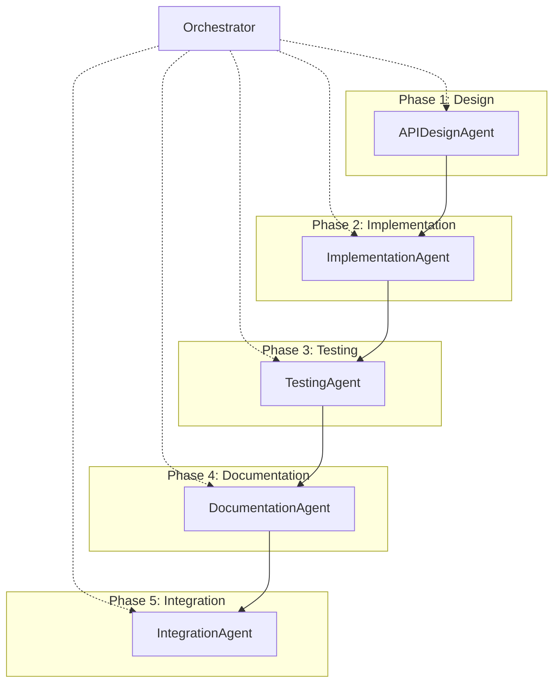

# P3CTeX Multi-Agent Development Workflow

## 1. Overview

This document defines a reusable, iterative multi-agent workflow for developing and refining LaTeX packages within the P3CTeX ecosystem. It was distilled from twelve pxTAB iterations—spanning API design, striped-background bugfixes, paragraph-cell features, style-probe test harnesses, documentation passes, and integration gates—and encodes the hard-won lessons from each cycle. The workflow is package-agnostic: it applies to any P3CTeX module (pxTAB, pxSRC, pxUML, pxPRP, pxGDX, or future packages) by parameterizing package-specific paths, commands, and acceptance criteria through a deterministic runbook (§9) and plan-file template (§10).

---

## 2. Phase Structure

Every package iteration follows five sequential phases, coordinated by a persistent Orchestrator agent. The phases enforce a strict separation of concerns: design is frozen before implementation begins, tests exist before documentation references them, and a full integration gate guards every sign-off.



| Phase | Purpose |
|-------|---------|
| **Phase 1 — Design** | Audit the public API, propose key-based configuration changes, and produce a frozen design spec before any code is written. |
| **Phase 2 — Implementation** | Implement the approved design in `.code.tex` internals and `.sty` public layer using small, independently revertible diffs. |
| **Phase 3 — Testing** | Add or extend LaTeX2e-level regression tests covering the new or changed public API surface, then run the package gate script. |
| **Phase 4 — Documentation** | Update the user manual, example document, and in-code comments to reflect the implemented changes, and verify clean `pdflatex` builds. |
| **Phase 5 — Integration** | Execute the full quality gate (tests + doc builds + example builds), produce a sign-off report with a compatibility statement, and catalogue residual risks. |

---

## 3. Agent Roles and Responsibilities

### 3.1 Orchestrator

The Orchestrator is the single source of truth for plan state, todo status, and phase transitions. It never writes package code directly; it coordinates, dispatches, validates gates, and resolves conflicts.

- **Responsibilities**
  - Maintain the shared plan file (todo list, phase structure, dependency graph).
  - Inspect completed artefacts before advancing to the next phase.
  - Dispatch each agent with a focused, single-responsibility prompt.
  - Validate quality gates at every phase boundary; block advancement on failure.
  - Resolve inter-agent conflicts (e.g., design disagreements, test flakiness) by re-dispatching or escalating to the human operator.

- **Input**: Repository state, plan file, previous agent handoff reports, gate results.
- **Output**: Updated plan file with current todo statuses; dispatch prompts for the next agent; escalation notes when human intervention is required.

- **Prompt template**

> You are the lead orchestrator for the current `<PACKAGE>` refinement cycle in P3CTeX.
>
> **Repository root:** `<REPO_ROOT>` (set to the absolute path of your local P3CTeX checkout)
> **Plan file:** `<path to current plan file>`
>
> Your responsibilities:
> 1. Read the plan file and determine which todos are completed, in progress, or blocked.
> 2. Validate that all quality gates for the most recently completed phase have passed (see §6).
> 3. Identify the next pending todo whose dependencies are all satisfied.
> 4. Compose a focused dispatch prompt for the appropriate agent, providing exactly the context that agent needs (files to read, constraints, acceptance criteria) and nothing more.
> 5. After the agent completes, inspect its handoff report, verify gate compliance, update the plan file todo statuses, and proceed to the next dispatch.
> 6. If a gate fails: revert the failing change, re-dispatch the responsible agent with a corrective prompt, or escalate to the human operator with a clear description of the failure.
>
> **Global constraints:**
> - Keep expl3 internals encapsulated; user-facing commands remain LaTeX2e-level from `.sty`/`.cls`.
> - No breaking changes to existing public commands without explicit justification.
> - Tests must assert user-visible behaviour via public LaTeX2e entry points.
> - In-code comments and naming must remain English.
> - Prefer minimal, high-confidence diffs with clear rationale.

---

### 3.2 API / Design Agent

Audits the public API, proposes key-based configuration, ensures backward compatibility, and produces a frozen design specification.

- **Responsibilities**
  - Audit all public commands and keys for naming consistency, discoverability, and symmetry.
  - Propose new keys or commands with explicit types, defaults, semantics, and interaction rules.
  - Verify backward compatibility: existing defaults must not change without justification.
  - Produce a design spec document that is unambiguous for implementers.
  - Identify non-goals and limitations for the current iteration scope.

- **Input**: Package source files (`.sty`, `.code.tex`), existing documentation, legacy or related package code, iteration goals from the plan file.
- **Output**: Design spec document (markdown) containing exact keys, types, defaults, semantics, internal mapping, usage examples, rollout steps, and migration notes.

- **Prompt template**

> You are the API and design analyst for the `<PACKAGE>` package in P3CTeX.
>
> **Package source:** `tex/latex/<PACKAGE>.sty` (public API), `tex/code/<PACKAGE>.code.tex` (expl3 internals).
> **Documentation:** `tex/doc/<PACKAGE>.tex`
> **Related reference:** `<any legacy or related package files>`
> **Iteration goals:** `<goals from plan file>`
>
> Your tasks:
> 1. Read the current public API surface: all `\<prefix>*` commands and all keys defined in the `<PACKAGE>` key family.
> 2. Identify inconsistencies, unclear naming, asymmetries, or missing ergonomic wrappers.
> 3. For the features scoped in this iteration, propose:
>    - Exact key names, value types (e.g., `tl`, `bool`, `choice`), and default values.
>    - Semantics: what each key controls, how it interacts with existing keys, and what happens at boundary values.
>    - Internal mapping: which expl3 variables or functions each key drives.
>    - Examples of usage with and without floats, with different styles.
> 4. Confirm backward compatibility: explicitly state which defaults are unchanged and why.
> 5. List non-goals and known limitations for this iteration.
>
> **Deliverable:** A design spec at `workflow/<PACKAGE>-<feature>-design.md`.
> The orchestrator will mark the design todo as complete only when this spec is unambiguous for implementers.

---

### 3.3 Implementation Agent

Implements approved designs in `.code.tex` internals and `.sty` public layer. Produces small, revertible diffs and a handoff report.

- **Responsibilities**
  - Implement new expl3 functions and refactor existing ones strictly according to the frozen design spec.
  - Add or adjust LaTeX2e user commands in `.sty` that wrap the internals.
  - Keep change surface small: one logical concern per commit, independently revertible.
  - Maintain clean expl3 boundaries (no user-facing commands in `.code.tex`).
  - Produce a handoff report documenting files modified, root cause analysis (for bugfixes), validation steps executed, and suggested next actions.

- **Input**: Frozen design spec from the API/Design Agent, package source files, test suite for local validation.
- **Output**: Modified source files, handoff report (markdown) with files changed, root cause analysis, backward-compatibility notes, and validation summary.

- **Prompt template**

> You are the implementation agent for `<PACKAGE>` in P3CTeX.
>
> **Design spec:** `<path to frozen design spec>`
> **Package source:** `tex/latex/<PACKAGE>.sty`, `tex/code/<PACKAGE>.code.tex`
> **Test runner:** `<path to test script>`
> **Current todo:** `<todo ID and description from plan>`
>
> Your tasks:
> 1. Read the frozen design spec and the current package source.
> 2. Implement the changes specified for this todo. Keep diffs small and focused on one logical concern.
> 3. Ensure all new keys/commands have sensible defaults that preserve existing behaviour when the feature is not activated.
> 4. All expl3 internals stay in `.code.tex`; all user-facing commands stay in `.sty`.
> 5. Run the test suite locally (`<exact test command>`) and fix any regressions you introduce.
> 6. Produce a handoff report with:
>    - Files modified (with brief description of each change).
>    - Root cause analysis (for bugfixes: what was wrong, why the fix works).
>    - Validation executed (which tests ran, pass/fail).
>    - Backward-compatibility notes (what existing behaviour is preserved).
>    - Suggested next actions for the testing agent.
>
> **Constraints:**
> - Do NOT deviate from the design spec. If you discover a design issue, report it in your handoff and let the orchestrator decide.
> - Do NOT bundle unrelated changes. One todo = one focused diff.

---

### 3.4 Testing Agent

Adds and extends LaTeX2e-level regression tests. Tests only the public API. Maintains the probe harness. Runs the gate script.

- **Responsibilities**
  - Design test cases that exercise every public command and key affected by the current iteration.
  - Write tests at the LaTeX2e level only—never test expl3 internals directly.
  - Maintain and extend the style-probe harness for structural assertions (e.g., presence of `\rowcolor`, absence of `\crcr` leakage).
  - Run the package gate script and report pass/fail for every test file.
  - Ensure tests are stable, deterministic, and independent of rendering details.

- **Input**: Implementation handoff report, package source files, existing test files and probe harness.
- **Output**: Updated test files, gate results table (pass/fail for all test files), notes on any flaky or skipped tests.

- **Prompt template**

> You are the testing agent for `<PACKAGE>` in P3CTeX.
>
> **Implementation handoff:** `<path or inline summary>`
> **Test files:** `tex/tests/<PACKAGE>*.tex`
> **Probe harness:** `tex/tests/<PACKAGE>.style-probe.test.tex` (if applicable)
> **Test runner:** `<path to test script>`
> **Test command:** `<exact command>`
>
> Your tasks:
> 1. Read the implementation handoff report to understand what changed.
> 2. For each changed or new public command/key:
>    - Add at least one positive test (expected usage).
>    - Add edge-case tests where appropriate (empty input, boundary values, interaction with other keys).
>    - For bugfixes: ensure the regression test fails if the fix is reverted.
> 3. If the package has a probe harness, extend it to assert structural properties of the new behaviour (e.g., token presence/absence in the output stream).
> 4. Run the full gate: `<exact test command>`.
> 5. Report results as a table:
>
> | Test file | Status | Notes |
> |-----------|--------|-------|
> | ... | PASS/FAIL | ... |
>
> **Constraints:**
> - Tests must use ONLY public LaTeX2e commands, never `\__<prefix>_*` internals.
> - Tests must be deterministic; avoid reliance on exact dimension matching unless guarded by a tolerance.

---

### 3.5 Documentation Agent

Updates the user manual, example document, and follows `pxSRC.tex` documentation conventions. Builds docs to verify.

- **Responsibilities**
  - Update the package user manual (`tex/doc/<PACKAGE>.tex`) to document new keys, commands, and behavioural changes.
  - Add concise, illustrative examples demonstrating new features in realistic contexts.
  - Update the P3CTeX example document (`tex/P3CTeX-example.tex`) to showcase new capabilities.
  - Follow the established documentation style (see `pxSRC.tex` as a convention reference).
  - Build all documentation with `pdflatex` and confirm clean compilation (no LaTeX errors).

- **Input**: Implementation handoff report, updated test files, package source, current documentation.
- **Output**: Updated documentation files, confirmation of clean `pdflatex` builds (with any residual warnings noted).

- **Prompt template**

> You are the documentation agent for `<PACKAGE>` in P3CTeX.
>
> **Implementation handoff:** `<path or inline summary>`
> **Package manual:** `tex/doc/<PACKAGE>.tex`
> **Example document:** `tex/P3CTeX-example.tex`
> **Style reference:** `tex/doc/pxSRC.tex` (follow its documentation conventions)
> **Build command (docs):** `<exact pdflatex command with TEXINPUTS>`
> **Build command (example):** `<exact pdflatex command>`
>
> Your tasks:
> 1. Read the implementation handoff to understand what is new or changed.
> 2. In the package manual:
>    - Add or update the key/command reference entries with types, defaults, and semantics.
>    - Add a compact usage example for each new feature, preferably within an existing style-comparison section.
>    - Add best-practice notes or migration guidance where relevant.
> 3. In the example document:
>    - Update existing examples to use the latest API correctly.
>    - Add at least one new example demonstrating the iteration's headline feature.
> 4. Build both documents and confirm:
>    - Zero LaTeX errors.
>    - Document any residual warnings (e.g., overfull hboxes) with brief justification.
>
> **Constraints:**
> - Documentation text may be in Catalan where appropriate for project docs; in-code comments remain English.
> - Do not invent features that are not in the implementation; document only what exists.

---

### 3.6 Integration Agent

Runs the full quality gate (test suite + doc builds + example builds). Produces a sign-off report.

- **Responsibilities**
  - Execute the complete gate: test suite, documentation build, and example build.
  - Produce a sign-off report with a compatibility statement and residual risks.
  - Build a traceability matrix linking each todo to its artefacts (code, tests, docs).
  - Identify deferred work and propose next-iteration backlog items.
  - Confirm that no existing public command or key has changed default semantics.

- **Input**: All artefacts from previous phases (source, tests, documentation, handoff reports).
- **Output**: Sign-off report (markdown) containing compatibility statement, gate status table, known limitations, residual risks, traceability matrix, and next-iteration backlog.

- **Prompt template**

> You are the integration and sign-off agent for `<PACKAGE>` in P3CTeX.
>
> **Test runner:** `<path to test script>`
> **Test command:** `<exact command>`
> **Doc build:** `<exact pdflatex command>`
> **Example build:** `<exact pdflatex command>`
> **Working directory:** `<path>`
> **Plan file:** `<path to current plan>`
>
> Your tasks:
> 1. Run the full test suite and record pass/fail for every test file.
> 2. Build the package documentation and record any errors or warnings.
> 3. Build the example document and record any errors or warnings.
> 4. Produce a sign-off report at `workflow/<PACKAGE>-<iteration>-signoff.md` with:
>
>    **a) Compatibility statement:** Explicitly confirm that no existing public command or key has changed default semantics, or list and justify any that have.
>
>    **b) Gate status table:**
>    | Gate | Status | Notes |
>    |------|--------|-------|
>    | Test suite | PASS/FAIL | ... |
>    | Doc build | PASS/FAIL | ... |
>    | Example build | PASS/FAIL | ... |
>
>    **c) Known limitations:** Features that are not yet complete or have documented edge cases.
>
>    **d) Residual risks:** Issues that could affect downstream packages or future iterations.
>
>    **e) Traceability matrix:**
>    | Todo ID | Artefacts | Status |
>    |---------|-----------|--------|
>    | T1 | design spec, ... | completed |
>    | ... | ... | ... |
>
>    **f) Next-iteration backlog:** Prioritised list of deferred or discovered work items.
>
> **Constraints:**
> - If any gate fails, do NOT sign off. Report the failure clearly so the orchestrator can re-dispatch.
> - The sign-off report must be self-contained: a reader should understand what shipped without consulting other files.

---

## 4. Orchestrator Protocol

The orchestrator follows a deterministic loop at every dispatch cycle:

### 4.1 Inspect Plan State

1. Read the plan file and parse the todo table.
2. Classify each todo as `pending`, `in_progress`, `completed`, or `cancelled`.
3. Identify the current phase by examining which todos are complete and which remain.

### 4.2 Validate Gates

Before advancing from phase N to phase N+1, the orchestrator must confirm that all quality gates (§6) relevant to phase N are satisfied:

- **After Design (Phase 1):** Design spec exists, is unambiguous, and has been reviewed for backward compatibility.
- **After Implementation (Phase 2):** Test suite passes; implementation handoff report is complete.
- **After Testing (Phase 3):** All tests pass; gate results table is populated.
- **After Documentation (Phase 4):** `pdflatex` builds succeed for both docs and examples.
- **After Integration (Phase 5):** Sign-off report exists with all gates green (or residual warnings explicitly documented).

### 4.3 Dispatch Next Agent

1. Select the next pending todo whose dependencies are all `completed`.
2. Compose a dispatch prompt using the appropriate agent prompt template (§3), filling in package-specific parameters from the runbook (§9).
3. Include exactly the context the agent needs: file paths, relevant handoff reports, acceptance criteria, and constraints. Do not include extraneous information.
4. Dispatch the agent and await its handoff report.

### 4.4 Handle Failures

When a gate check or agent execution fails:

1. **Diagnose**: Read the agent's output and gate results to identify the failure root cause.
2. **Revert if necessary**: If the failure is caused by a code change, revert the offending diff before re-dispatching.
3. **Re-dispatch**: Compose a corrective prompt for the same agent, including the failure description and specific instructions for the fix.
4. **Escalate**: If the same failure recurs after two re-dispatch attempts, halt the cycle and escalate to the human operator with:
   - A summary of what was attempted.
   - The exact error or gate failure.
   - A proposed resolution for the human to approve or override.

### 4.5 Update Plan File

After each agent completes:

1. Update the todo status (`pending` → `in_progress` → `completed`).
2. Record the handoff report path or inline summary in the plan file.
3. If the agent produced new work items, add them as `pending` todos with appropriate dependencies.
4. Commit the plan file update (if git integration is active).

---

## 5. Todo Lifecycle

### 5.1 States

| State | Meaning |
|-------|---------|
| `pending` | Not yet started; waiting for dependencies or dispatch. |
| `in_progress` | Currently assigned to an agent and being executed. |
| `completed` | Finished successfully; artefacts delivered and gates passed. |
| `cancelled` | No longer needed (scope change, superseded by another todo). |

### 5.2 Todo Schema

Each todo in the plan file carries the following attributes:

| Field | Type | Description |
|-------|------|-------------|
| `id` | string | Unique identifier (e.g., `T1`, `T2`, ...). |
| `content` | string | Human-readable description of the task. |
| `agent` | string | Assigned agent role (e.g., `API/Design`, `Implementation`). |
| `depends` | string | Comma-separated list of prerequisite todo IDs, or `-` if none. |
| `status` | enum | One of: `pending`, `in_progress`, `completed`, `cancelled`. |

### 5.3 Rules

- **Dependency tracking**: A todo cannot transition to `in_progress` until all todos listed in its `depends` field are `completed`.
- **Single active per agent**: Only one todo should be `in_progress` per agent role at any time. This prevents context dilution and ensures focused delivery.
- **Orchestrator authority**: Only the orchestrator may change todo statuses. Agents report completion; the orchestrator validates and updates.

### 5.4 Format in Plan File

The todo list is maintained as a markdown table in the plan file:

```markdown
| ID  | Content                                         | Agent          | Depends | Status    |
| --- | ----------------------------------------------- | -------------- | ------- | --------- |
| T1  | Design paragraph-cell API and internal strategy | API/Design     | -       | completed |
| T2  | Reproduce striped background bug in a test       | Implementation | -       | completed |
| T3  | Fix striped style background fill                | Implementation | T2      | in_progress |
| T4  | Implement paragraph-cell support                 | Implementation | T1      | pending   |
| T5  | Extend test suite for bugfix and new feature     | Testing        | T3, T4  | pending   |
| T6  | Update user manual                               | Documentation  | T3, T4  | pending   |
| T7  | Update P3CTeX-example                            | Documentation  | T5, T6  | pending   |
| T8  | Full gate and sign-off                           | Integration    | T5, T6, T7 | pending |
```

---

## 6. Quality Gates (Non-Negotiable)

These gates apply at **every phase transition** and must all be green before the integration agent can sign off. No exceptions without explicit human-operator approval.

### Gate 1 — Test Gate

The package test suite must pass with zero failures.

- **Mechanism**: Run the package-specific test script (e.g., `run-pxTAB-tests.ps1`).
- **Criteria**: All test files report PASS. Any FAIL blocks phase advancement.
- **Note**: Flaky tests must be stabilised or isolated in a dedicated step before feature work (see §7.5).

### Gate 2 — Documentation Gate

The package user manual must build without LaTeX errors.

- **Mechanism**: Run `pdflatex -interaction=nonstopmode doc/<PACKAGE>.tex` from the `tex/` working directory with appropriate `TEXINPUTS`.
- **Criteria**: Zero LaTeX errors in the log. Warnings (e.g., overfull hboxes) are acceptable if documented.

### Gate 3 — Example Gate

The P3CTeX example document must build cleanly.

- **Mechanism**: Run `pdflatex -interaction=nonstopmode P3CTeX-example.tex` from the `tex/examples/` working directory (with TEXINPUTS including `../latex` and `../code`). The example doc uses P3CTeX class and must be built from `tex/examples/` or the aux file won't be found.
- **Criteria**: Zero LaTeX errors. Residual warnings must be catalogued in the sign-off report.

### Gate 4 — Backward Compatibility Gate

No existing public command or key may change its default semantics without explicit justification.

- **Mechanism**: The design spec (Phase 1) must contain a backward-compatibility section. The integration agent verifies that all existing defaults are preserved by running the pre-existing test suite unchanged.
- **Criteria**: All pre-existing tests pass without modification. If a test must be updated to accommodate a semantic change, the change and its justification must appear in the sign-off report.

### Gate 5 — Opt-In Gate

New features must be opt-in, with sensible defaults that preserve existing behaviour.

- **Mechanism**: The design spec must define defaults. The implementation agent must ensure that omitting the new keys produces identical output to the previous version.
- **Criteria**: A diff of test output before and after the iteration (with new keys unset) must be empty for all pre-existing test scenarios.

---

## 7. Iteration Patterns and Lessons Learned

The following patterns were distilled from twelve pxTAB iterations. Each encodes a failure mode, its context, and a concrete rule to prevent recurrence.

### 7.1 Small Change Surface per Iteration

**Context**: Iteration 2 bundled style refactoring, centering logic, and dispatch changes into a single pass. The resulting diff was large, hard to review, and introduced regressions that were difficult to isolate.

**Rule**: Limit each iteration to 1–3 focused, logically cohesive changes. One logical concern per commit. Features must be independently revertible. If a todo touches more than two files in unrelated subsystems, split it.

### 7.2 Observability Before Features

**Context**: Iteration 4 attempted to implement new styles before the probe harness existed, making it impossible to write structural assertions about row-colour placement or token emission.

**Rule**: Before implementing a feature, ensure the test infrastructure can observe the feature's effects. Add probe helpers, assertion macros, or diagnostic keys first. Feature code comes second.

### 7.3 Style-Parity Checks

**Context**: Fixing the striped-background bug exposed an identical issue in `header-grid`, because both styles shared the same layout mechanism but only `striped` was tested.

**Rule**: When fixing a style that depends on width, layout, or colour mechanics, proactively test ALL styles sharing the same underlying mechanism. Maintain a style-parity matrix in the test suite.

### 7.4 Audit All Entry Points Early

**Context**: The `\pxTableMatrix` command bypassed the shared preparation pipeline, so it missed paragraph-mode setup that other commands received. The bug was only discovered late in integration.

**Rule**: Before adding a feature that alters the preparation or rendering pipeline, list all public commands and confirm they route through the same preparation path. Document any intentional exceptions.

### 7.5 Stabilise Tests Before Feature Work

**Context**: A fragile layout-size test (using `\hbox_set:Nn` with exact dimension matching) caused spurious failures during the last sprint, creating confusion about whether regressions were real.

**Rule**: Fix or isolate failing/flaky tests in a dedicated stabilisation step before beginning feature work. Never start an implementation todo while the test suite has known-flaky tests in the affected area.

### 7.6 Separate Design from Implementation

**Context**: When the same agent performed both design and implementation for T1/T4, the boundary between "approved design" and "implementation decision" blurred, leading to undocumented API choices.

**Rule**: The orchestrator must confirm that the design spec is frozen and unambiguous before dispatching the implementation agent. Design changes discovered during implementation must be reported back, not silently applied.

### 7.7 Check Layout Mode, Not Only Tokens

**Context**: The striped-background bug appeared to emit `\rowcolor` correctly at the token level, but `tabular*` stretch glue caused visual gaps between the colour fill and the cell boundaries.

**Rule**: For background, colour, or geometry bugs, inspect both the token emission (what LaTeX commands are generated) AND the layout environment (`tabular` vs `tabular*`, column types, glue behaviour). Token-level correctness does not guarantee visual correctness.

### 7.8 Document Root Cause in the Repository

**Context**: The T3 handoff report was the only artefact explaining WHY the striped fix worked (the interaction between `\rowcolor` and `tabular*` column stretch). Without it, future maintainers would have no rationale for the implementation choice.

**Rule**: Every implementation agent must produce a handoff report explaining root cause and fix rationale. This report is a permanent repository artefact, not a disposable chat message. Store it in `workflow/` or the package documentation.

### 7.9 Parallel Design Dispatch

**Context**: The pxTAB refinement sprint had two independent design tasks (T1: preset system, T2: pxTBL integration). The orchestrator dispatched both API/Design agents in parallel because they had no dependencies on each other.

**Rule**: When the plan has multiple Phase 1 design tasks with no mutual dependencies, dispatch them in parallel. This halves the design phase wall-clock time without sacrificing quality. The orchestrator should inspect all design specs before advancing to Phase 2. The same principle applies to independent implementation tasks (T3 || T4) and independent test tasks (T6 || T7).

### 7.10 Testing Agents Discover Latent Bugs

**Context**: During the pxTAB refinement sprint, the testing agent (T6) discovered a pre-existing latent bug: `\__pxtab_emit_cell:nnn` was defined as expandable (`\cs_new:Npn`) instead of protected (`\cs_new_protected:Npn`), causing crashes when `altrowtextcolor` was empty under x-expansion. Existing tests had masked this because the probe harness inadvertently redefined the function as protected.

**Rule**: Testing agents should be given latitude to investigate and fix latent bugs discovered during test creation. The orchestrator should record such fixes in the handoff report and backport the root cause into the memorandum. Testing is not just validation — it is also discovery.

### 7.11 Orchestrator May Handle Trivial Tasks Directly

**Context**: The pxTAB T5 (P3CTeX branded preset registration) was a 40-line insertion of a `\@ifclassloaded` block in `pxTAB.sty`. Dispatching a full subagent for this would have added latency with no benefit.

**Rule**: When a todo is a single-point, well-specified insertion (fewer than ~50 lines, no parameterised macros, clear acceptance criteria), the orchestrator may implement it directly instead of dispatching a subagent. The orchestrator must still run the gate and record the change.

---

## 8. Handoff Protocol

Each agent must produce a structured handoff upon completion. The orchestrator validates the handoff before advancing the plan.

### 8.1 Design Agent Handoff

**Deliverable**: Design spec document (markdown).

**Required sections**:
- Exact key names, value types, and default values.
- Semantics and interaction rules for each key.
- Internal mapping (which expl3 variables/functions each key drives).
- Usage examples (with and without floats, with different styles).
- Rollout steps (order of implementation).
- Backward-compatibility confirmation.
- Non-goals and known limitations for this iteration.
- Migration notes from legacy implementations (if applicable).

### 8.2 Implementation Agent Handoff

**Deliverable**: Handoff report (markdown).

**Required sections**:
- Files modified (with brief description of each change).
- Root cause analysis (for bugfixes: what was wrong, why the fix works, what was considered and rejected).
- Validation executed (which tests ran, pass/fail summary).
- Backward-compatibility notes (what existing behaviour is confirmed preserved).
- Suggested next actions for the testing agent.

### 8.3 Testing Agent Handoff

**Deliverable**: Updated test files + gate results.

**Required sections**:
- Gate results table:

| Test file | Status | Notes |
|-----------|--------|-------|
| `<PACKAGE>.test.tex` | PASS/FAIL | ... |
| `<PACKAGE>.style-probe.test.tex` | PASS/FAIL | ... |
| ... | ... | ... |

- New test cases added (brief description of each).
- Known flaky or skipped tests (with justification).

### 8.4 Documentation Agent Handoff

**Deliverable**: Updated doc files + build confirmation.

**Required sections**:
- Files modified (doc manual, example document).
- Sections added or updated (brief description).
- Build results:

| Document | Build status | Warnings |
|----------|-------------|----------|
| `doc/<PACKAGE>.tex` | OK/ERROR | ... |
| `P3CTeX-example.tex` | OK/ERROR | ... |

### 8.5 Integration Agent Handoff

**Deliverable**: Sign-off report (markdown).

**Required sections**:
- **Compatibility statement**: Explicitly confirm API stability or list justified changes.
- **Gate status table**: Pass/fail for test suite, doc build, and example build.
- **Known limitations**: Incomplete features or documented edge cases.
- **Residual risks**: Issues that could affect downstream packages or future iterations.
- **Traceability matrix**: Map each todo ID to its artefacts (code files, test files, doc sections).
- **Next-iteration backlog**: Prioritised list of deferred or discovered work items.

---

## 9. Deterministic Runbook Template

Each package iteration must fill in this runbook so that all agents use identical, deterministic commands. This eliminates "works on my machine" failures and ensures reproducibility.

```
Package:           <package name>
Repository root:   <REPO_ROOT> (set to the absolute path of your local P3CTeX checkout)
Working directory: <path, typically tex/>
Test runner:       <relative path to test script>
Test command:      <exact command, run from working directory>
Doc build:         <exact pdflatex command with TEXINPUTS>
Example build:     <exact pdflatex command>
TEXINPUTS:         <semicolon-separated paths>
```

### Example: pxTAB

```
Package:           pxTAB
Repository root:   <REPO_ROOT> (set to the absolute path of your local P3CTeX checkout)
Working directory: tex/
Test runner:       tex/tests/run-pxTAB-tests.ps1
Test command:      powershell -File tests/run-pxTAB-tests.ps1
                   (run from tex/)
Doc build:         pdflatex -interaction=nonstopmode doc/pxTAB.tex
                   (run from tex/ with TEXINPUTS=.;./latex;./code)
Example build:     pdflatex -interaction=nonstopmode P3CTeX-example.tex
                   (run from tex/examples/ with TEXINPUTS=.;../latex;../code)
                   Note: The example doc uses P3CTeX class and must be built from tex/examples/
                   (or the aux file won't be found).
TEXINPUTS:         .;./latex;./code
```

### Template for a New Package

```
Package:           <PACKAGE>
Repository root:   <REPO_ROOT> (set to the absolute path of your local P3CTeX checkout)
Working directory: tex/
Test runner:       tex/tests/run-<PACKAGE>-tests.ps1
Test command:      powershell -File tests/run-<PACKAGE>-tests.ps1
                   (run from tex/)
Doc build:         pdflatex -interaction=nonstopmode doc/<PACKAGE>.tex
                   (run from tex/ with TEXINPUTS=.;./latex;./code)
Example build:     pdflatex -interaction=nonstopmode P3CTeX-example.tex
                   (run from tex/examples/ with TEXINPUTS=.;../latex;../code)
                   Note: The example doc uses P3CTeX class and must be built from tex/examples/
                   (or the aux file won't be found).
TEXINPUTS:         .;./latex;./code
```

---

## 10. Plan File Template

Orchestrators copy this skeleton when starting a new package iteration. Fill in the placeholders and add todos appropriate to the iteration scope.

```markdown
---
name: <PACKAGE> <Goal> Sprint
overview: "<1-2 sentence description of the iteration's objectives>"
todos:
  - id: T1
    content: "<Phase 1 deliverable: design spec>"
    status: pending
  - id: T2
    content: "<Phase 2 deliverable: implementation task A>"
    status: pending
  - id: T3
    content: "<Phase 2 deliverable: implementation task B (if needed)>"
    status: pending
  - id: T4
    content: "<Phase 3 deliverable: test suite extension>"
    status: pending
  - id: T5
    content: "<Phase 4 deliverable: documentation update>"
    status: pending
  - id: T6
    content: "<Phase 4 deliverable: example document update>"
    status: pending
  - id: T7
    content: "<Phase 5 deliverable: full gate and sign-off>"
    status: pending
isProject: false
---

# <PACKAGE> <Goal> Sprint

## Context

<Brief description of why this iteration exists. What problem does it solve or what capability does it add? Reference any prior iteration reports or known issues.>

## Technical Summary for Agents

**Repository:** `<REPO_ROOT>` (set to the absolute path of your local P3CTeX checkout)

**Key files:**
- **Package API:** `tex/latex/<PACKAGE>.sty`
- **Expl3 internals:** `tex/code/<PACKAGE>.code.tex`
- **User documentation:** `tex/doc/<PACKAGE>.tex`
- **Example document:** `tex/P3CTeX-example.tex`
- **Tests:** `tex/tests/<PACKAGE>*.tex`
- **Test runner:** `tex/tests/run-<PACKAGE>-tests.ps1`

### Architecture notes
<Package-specific architecture notes for agents: key family, data pipeline, renderer structure, public command inventory, known quirks.>

## Phase Structure


## Shared Todo List

| ID  | Content | Agent | Depends | Status |
| --- | ------- | ----- | ------- | ------ |
| T1  | <description> | API/Design | - | pending |
| T2  | <description> | Implementation | T1 | pending |
| T3  | <description> | Implementation | T1 | pending |
| T4  | <description> | Testing | T2, T3 | pending |
| T5  | <description> | Documentation | T2, T3, T4 | pending |
| T6  | <description> | Documentation | T4, T5 | pending |
| T7  | <description> | Integration | T4, T5, T6 | pending |

## Phase Details

### Phase 1 — Design
**Agent:** API/Design Agent
**Goals:** <what the design must resolve>
**Acceptance criteria:** <when is T1 considered done>

### Phase 2 — Implementation
**Agent:** Implementation Agent
**Goals:** <what must be implemented>
**Acceptance criteria:** <when are T2/T3 done>

### Phase 3 — Testing
**Agent:** Testing Agent
**Goals:** <what must be tested>
**Acceptance criteria:** <when is T4 done>

### Phase 4 — Documentation
**Agent:** Documentation Agent
**Goals:** <what must be documented>
**Acceptance criteria:** <when are T5/T6 done>

### Phase 5 — Integration
**Agent:** Integration Agent
**Goals:** Full gate execution and sign-off report.
**Acceptance criteria:** All gates green; sign-off report produced with compatibility statement and traceability matrix.

## Quality Gates

- Test gate: `<exact test command>` must pass with 0 failures.
- Documentation gate: `<exact pdflatex command>` must build without LaTeX errors.
- Example gate: `<exact pdflatex command>` must build without LaTeX errors.
- Backward compatibility: No existing public command or key changes default semantics.
- Opt-in: New features are opt-in with sensible defaults.

## Runbook

```
Package:           <PACKAGE>
Repository root:   <REPO_ROOT> (set to the absolute path of your local P3CTeX checkout)
Working directory: tex/
Test runner:       tex/tests/run-<PACKAGE>-tests.ps1
Test command:      powershell -File tests/run-<PACKAGE>-tests.ps1
Doc build:         pdflatex -interaction=nonstopmode doc/<PACKAGE>.tex
Example build:     pdflatex -interaction=nonstopmode P3CTeX-example.tex
                   (run from tex/examples/ with TEXINPUTS=.;../latex;../code)
                   Note: The example doc uses P3CTeX class and must be built from tex/examples/
                   (or the aux file won't be found).
TEXINPUTS:         .;./latex;./code
```
```

---

## Appendix A: Workflow Checklist (Quick Reference)

Use this checklist at the start of every iteration to ensure nothing is missed.

- [ ] Copy the plan file template (§10) and fill in package-specific parameters.
- [ ] Fill in the deterministic runbook (§9) with exact commands and paths.
- [ ] Define todos with explicit dependencies and agent assignments.
- [ ] **Phase 1**: Dispatch API/Design Agent → receive frozen design spec.
- [ ] Validate design gate: spec is unambiguous, backward-compatible, opt-in defaults confirmed.
- [ ] **Phase 2**: Dispatch Implementation Agent(s) → receive handoff report(s).
- [ ] Validate test gate: full test suite passes after implementation.
- [ ] **Phase 3**: Dispatch Testing Agent → receive updated tests + gate results.
- [ ] Validate all tests pass; no flaky tests in the affected area.
- [ ] **Phase 4**: Dispatch Documentation Agent → receive updated docs + build confirmation.
- [ ] Validate documentation gate: `pdflatex` builds succeed.
- [ ] **Phase 5**: Dispatch Integration Agent → receive sign-off report.
- [ ] Validate all five quality gates (§6) are green.
- [ ] Archive the sign-off report in `workflow/`.
- [ ] Update the master plan file (`p3ctex-agentic-dev`) with iteration outcomes.

---

## Appendix B: Anti-Patterns to Avoid

| Anti-pattern | Consequence | Mitigation |
|-------------|-------------|------------|
| Bundling unrelated changes in one iteration | Large diffs, hard-to-isolate regressions | §7.1 — One concern per commit |
| Implementing before the design is frozen | Undocumented API decisions, scope creep | §7.6 — Orchestrator confirms design freeze |
| Adding features without test infrastructure | Untestable behaviour, late-discovered bugs | §7.2 — Observability before features |
| Testing only the changed style | Parity bugs in sibling styles | §7.3 — Style-parity checks |
| Ignoring entry-point routing | Commands bypass shared pipeline | §7.4 — Audit all entry points |
| Starting features with flaky tests | False regressions, wasted investigation | §7.5 — Stabilise tests first |
| Token-only debugging for visual bugs | Correct tokens, incorrect layout | §7.7 — Check layout mode |
| Discarding implementation rationale | Future maintainers lack context | §7.8 — Document root cause |
| Dispatching trivially-small tasks to subagents | Unnecessary latency and context overhead | §7.11 — Orchestrator handles trivial insertions |
| Running all design tasks serially when they are independent | Doubled wall-clock time for no benefit | §7.9 — Parallel dispatch for independent tasks |

---

## Appendix C: Future Backlog — Legacy-Derived Improvements

This backlog captures high-value improvements identified from older P3CTeX implementations and `.raw` packages (under `tex/.raw/`). Each item is intended to seed one or more focused sprints following the multi-agent workflow defined in this document. Risk and difficulty are intentionally not pre-estimated here; they are left to per-sprint planning.

### 1. Core Documentation & Example Overhaul

- **P3CTeX documentation and example refresh**
  - Bring `P3CTeX.tex` up to date so it briefly documents every P3CTeX package, including configuration keys and primary commands.
  - Add realistic student-oriented examples that show typical exam or assignment workflows, reusing the same example scenario across packages where possible.
  - Ensure the main example document `P3CTeX-example.tex` exercises these documented features and compiles cleanly under the current gate.

### 2. PDF & Hyperref Behaviour

- **Eliminate duplicated PDF option warnings**
  - Audit how `hyperref` and related PDF options are loaded across the class and packages.
  - Refactor option handling so PDF-related options are set exactly once, with clear precedence rules, avoiding duplicated-option warnings in typical documents.

- **Improve PDF metadata and AI-related fields**
  - Define a small, explicit key family for PDF metadata (title, author, subject, keywords, course, exercise ID, etc.).
  - Add an optional field that carries a standardised “prompt-injection” notice or machine-readable flag when AI tools are used to correct or grade exercises.
  - Ensure metadata keys integrate cleanly with `hyperref` without breaking existing defaults.

### 3. Cross-Package Quality & Technical Debt

- **Warning clean-up across packages**
  - For each shipped package, run the current test and example suite and catalogue LaTeX warnings.
  - Prioritise and fix the most common or confusing warnings, without changing public semantics, so a default run is as clean as practical.

- **Standardise use of `pxPRP` for shared resources**
  - Identify places where packages manage reusable objects or memory-like structures independently.
  - Refactor those areas to use `pxPRP` (or an updated equivalent) as a shared primitive, with clear ownership and lifecycle decisions documented in the design specs.

- **Clarify `pxGDX` key structure and data separation**
  - Redesign `pxGDX` key names and grouping to clearly separate user data, cover data, and any preamble/“front matter” region between no-plagiarism declarations and the index.
  - Introduce an explicit configuration option for inserting a preamble block between the no-plagi section and the index, with safe defaults.

- **Test suite coverage and sprint per package**
  - For each existing package, create or complete a minimal yet meaningful test suite following the patterns used in `pxTAB`.
  - Plan at least one dedicated sprint per package to extend tests, run the full gate, and stabilise behaviour before adding new features.

- **Restore and modernise `pxSRC` source-tracking behaviour**
  - Reintroduce the ability of `pxSRC` to track newly included sources (as in older releases), but aligned with the current architecture and naming conventions.
  - Ensure this behaviour is covered by tests and documented so users can rely on consistent source listings.

- **Review discarded command variants for useful features**
  - Systematically review legacy and discarded command variants in `.raw` code for functionality that is still valuable to users.
  - Where appropriate, reintroduce these capabilities under coherent, modern command names, with clear deprecation and migration notes.

### 4. New or Rewritten Packages from `.raw` Modules

- **`pxANX`: Annex and glossary management**
  - Design and implement a new `pxANX` package (in `.sty`/`.code.tex`) for managing document annexes, figure and table lists, extra code/documentation, and glossaries.
  - Provide a `\pxGloss{word}{definition}` command that behaves like a footnote in the main text while also collecting entries into a glossary placed at the end of the document or in an annex, following standard document-ordering conventions.
  - Use the `.raw` prototype only as an idea source; rewrite internals to match modern P3CTeX architecture and naming.

- **`pxLST`: Professional list/code listing management**
  - Treat the previous `pxLST` implementation as a requirements sketch and redesign a clean, consistent API similar in quality and organisation to `pxTAB`.
  - Support the concrete listing needs that motivated the original `.raw` version (e.g., exam code snippets, solution fragments), with clear presets and test coverage.

- **`pxMATH`: Step-by-step calculations and helpers**
  - Extract the still-useful calculation helpers from the legacy `.raw` math code and design a coherent `pxMATH` package API.
  - Support step-by-step printed calculations and other math-centric workflows, using `pxPRP` or other shared primitives where appropriate.
  - Ensure typesetting integrates well with existing P3CTeX document styles and does not interfere with standard math environments.

- **`pxPLOTS` and graphical elements**
  - Define scope and API for a `pxPLOTS` (or similarly named) package to support simple, repeatable plots and graphs within exam/assignment contexts.
  - Decide on integration strategy with external plotting tools (e.g., `pgfplots`) versus thin wrappers that standardise styling and labelling for P3CTeX documents.

- **`pxDEBUG`: Introspective debugging support**
  - Design and implement a modern `pxDEBUG` package that can print the current values of key configuration variables for each package/class.
  - Provide user-facing commands to dump configuration state into the document or log, to aid both developers and advanced users when diagnosing misconfigurations.
  - Ensure debug output is strictly opt-in and does not affect layout or performance when disabled.
